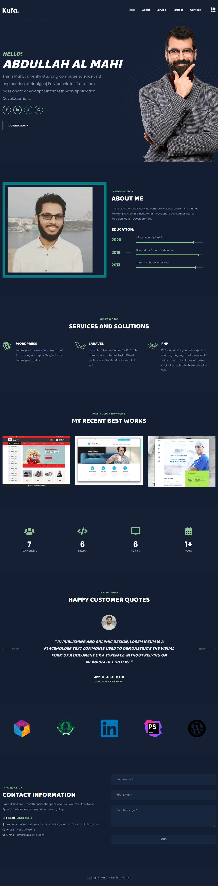

# Kufa
 

 

      

          

       Kufa - is a modern and functional Dynamic portfolio wesite for your Personal and company portfolio website &amp; Resume. Kufa Portfolio has an intuitive visual interface and informative layout that looks wonderful on any portfoio, since it’s fully dynamic for any kind of portfolio website .It is perfect for your personal or company !

           
  
 step 1: clone or download it : https://github.com/aamahi/kufa/ 

  
 step 2 : create_database name name: kufa 

  
 step 3 : import (kufa.sql) file in your database (kufa)

  
 step 4 : Run the project. 
  -> admin : 
http://localhost/kufa/admin 

  -> Frontend : 
 http://localhost/kufa 

  
 step 5 : Register a account with valid info  or direct login : (Email: obaidul@obi.com and Password : Obaidul5)  

  
 step 6 : login . 

# Some screenshoot of the project
### Frontend

### Backend or Admin

##Thank you 
