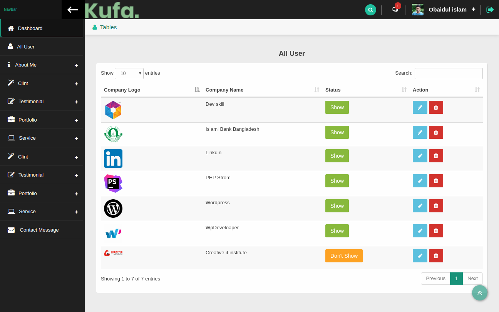
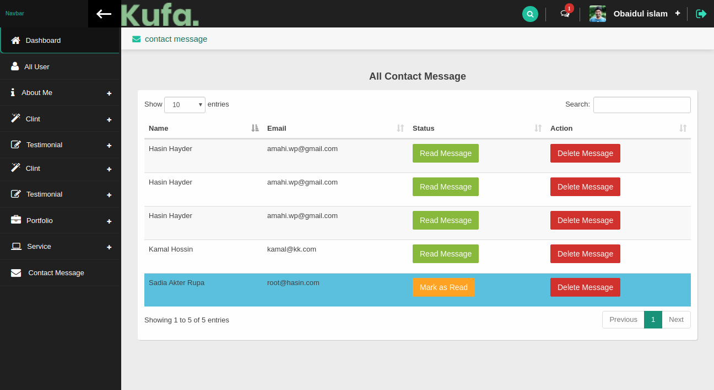

# Kufa
 

 

      

          

        Teashop –  Kufa is a modern and functional Dynamic portfolio wesite for your Personal and company portfolio website &amp; Resume. Kufa Portfolio has an intuitive visual interface and informative layout that looks wonderful on any portfoio, since it’s fully dynamic for user friendly.It is perfect for your personal or company !

           
  
 step 1: clone or download it : https://github.com/aamahi/kufa/ 

  
 step 2 : create_database name name: kufa 

  
 step 3 : insert import (kufa.sql) file 

  
 step 4 : Run the project. 
  -> admin : http://localhost/kufa/admin 
  -> Frontend : http://localhost/kufa
  
 step 5 : Register a account with valid info  or direct login : (Email: obaidul@obi.com and Password : Obaidul5)  

  
 step 6 : login . 

# Some screenshoot of the project
### Frontend

### Backend or Admin

##Thank you 
